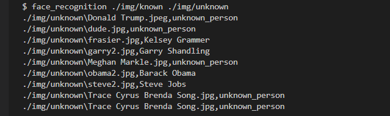

# Python Facial Recognition

A repo of practice with Python's Facial Recognition library. Some of this is done with terminal commands in a virtual environment.

### Usage

- Make sure that you have the most up to date version of Python and the package manager pip installed.
- Make sure that you have `$ pipenv` installed by using `$ pip install pipenv` from the terminal.
- Use command `$ pipenv shell` to start virtual environment.
- Once working in the virtual environment, run command `$ pipenv install face_recognition` (If there is an error during installation, run `$ pip install cmake`, and then run command `$ pip --no-cache-dir install face_recognition`).
- Happy coding!~

### How it Works
Using the command line, we compare the unknown images in our unknown folder against the folder of known images to see if they are similar in structure using the command `$ face_recognition ./img/known ./img/unknown`, and displays what person that image matches, or if it is an `unknown_person`.

#### Lookalikes

We can even see how it performs against lookalikes, and see the distance between how similar one face in a picture is to another by adding the flag `--show-distance true` to our command.

#### Tolerance

We can limit how similar a face can be before it is recognized as a known person by setting the flag `--tolerance n` and defining amount `n`.

And it will register the Barack Obama lookalike is now an unknown_person, because the tolerance is nearly 0.6.

#### List Names

We are also able to have only the names associated with the found images with the command `$ face_recognition ./img/known ./img/unknown | cut -d ',' -f2`.

#### Find Multiple Faces

With a combination of the face_recognition and the Pillow imaging library, we're able to find individual faces in an image and manipulate them. There's a great deal of functionality built into the library in that we can pull the image coordinates of each individual face :

We can list the number of faces found in a given image:

And we're even able to pull the found faces out into their own individual images and save them as new images:

#### Identify People

Using the Pillow imaging library, we can effectively 'tag' a found person similar to the way that Facebook does. We utilize the face encodings mapped by the library, and store those coordinates in a variable to compare them against with other images of that person.

And that's it so far for our experimentation with Python's Facial Recognition library!